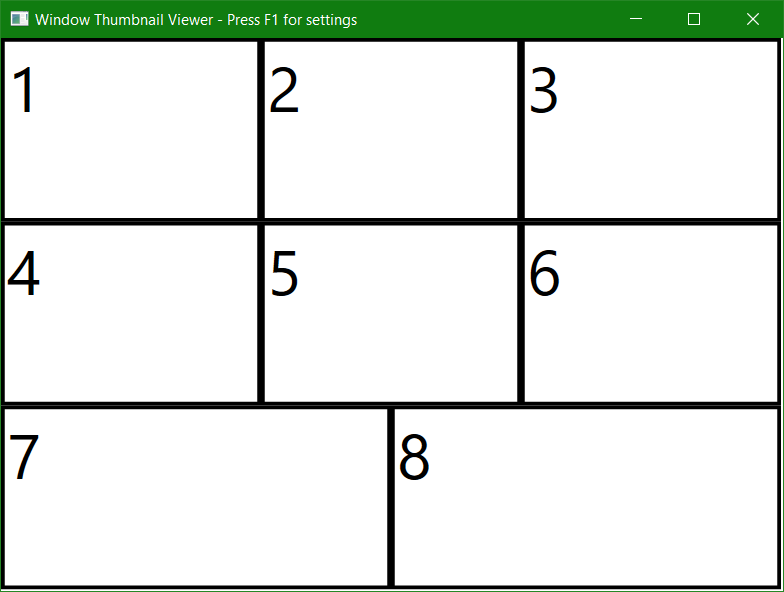
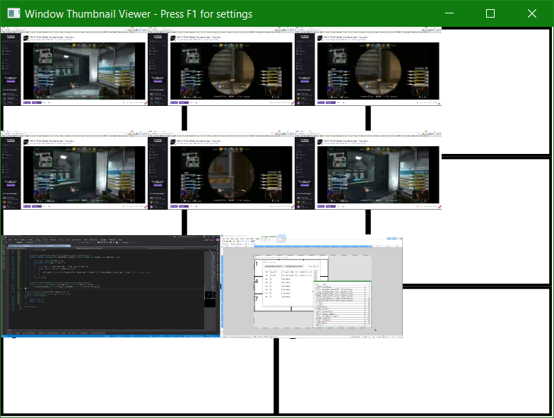

# Window-Thumbnail-Viewer
This utilizes DWM library to create 1 to 16 thumbnails of other windows by their handles.

Can create 1 to 16 regions for Thumbnails.
For demontration here is 8: 

Utilizes few helper methods for splitting rectangles and with LINQ generation of all 1-16 is relatively easy.

In settings (via F1) you can set the number of regions and Refresh Handles
See here: 

Selection of handles looks like this:

And lastly generation of DWM Thumbnails (via F5):

As you can see, rendering of DWM Thumbnails isn't working properly.

TODO:
- Automatic refresh (as with F5) when resizing
- Fix DWM Thumbnails positioning and sizes ( http://answers.microsoft.com/en-us/windows/forum/apps_windows_10-winapps/dwm-thumbnail-size-in-wpf-x-winforms-on-windows-10/6b7137c7-1b17-4975-982f-8146a355b098 )
