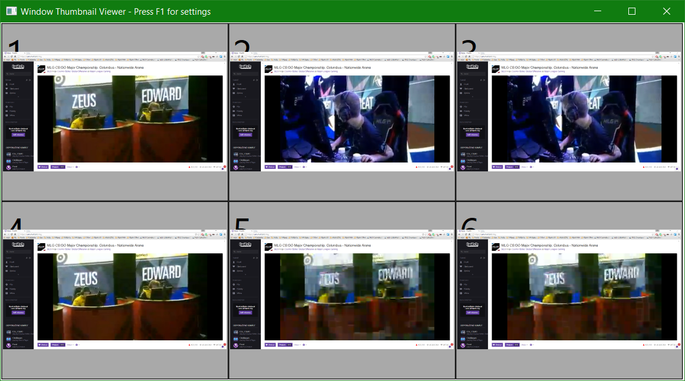
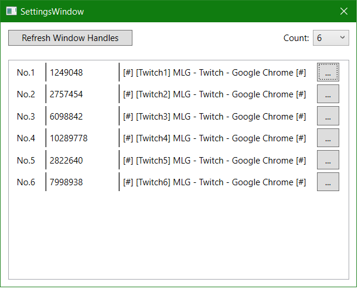
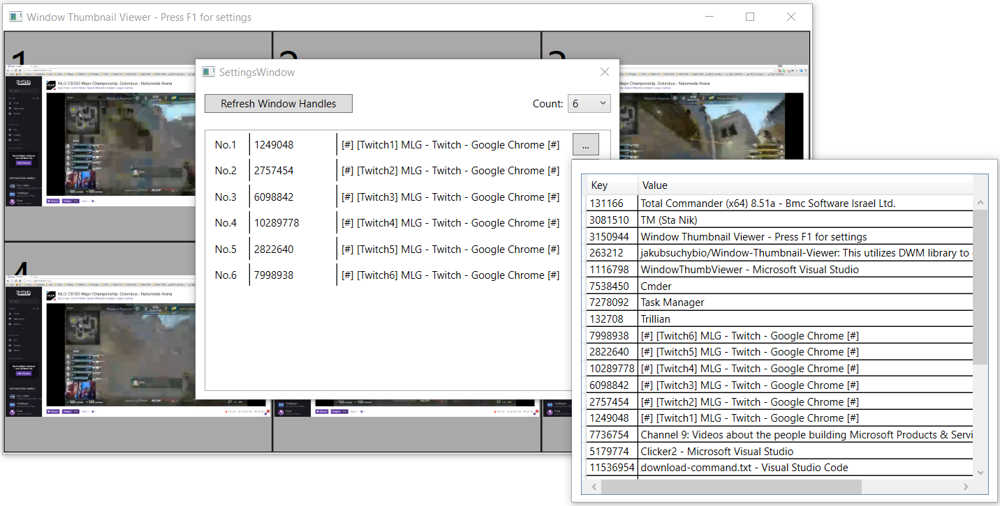

# Window-Thumbnail-Viewer

This utilizes DWM library to create 1 to 16 thumbnails of other windows by their handles.

## Requirements:
- Windows Vista or later

## Features:

- Can create 1 to 16 regions for Thumbnails. 
For demontration here is 8:

- Utilizes few helper methods for splitting rectangles and with LINQ generation of all 1-16 is relatively easy.

- In settings (via F1) you can set the number of regions and Refresh Handles:

- Selection of handles looks like this:

- You can trigger auto resizing with F2
- You can also auto-refresh all selected Twitch handles with F5
